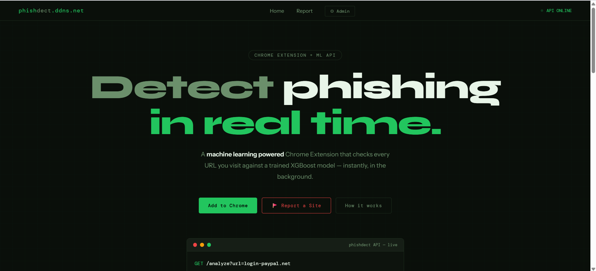
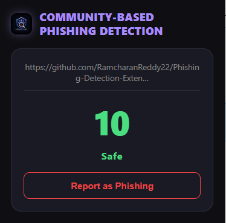
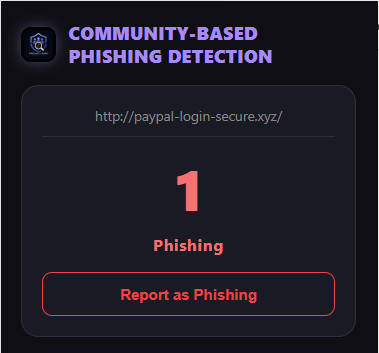
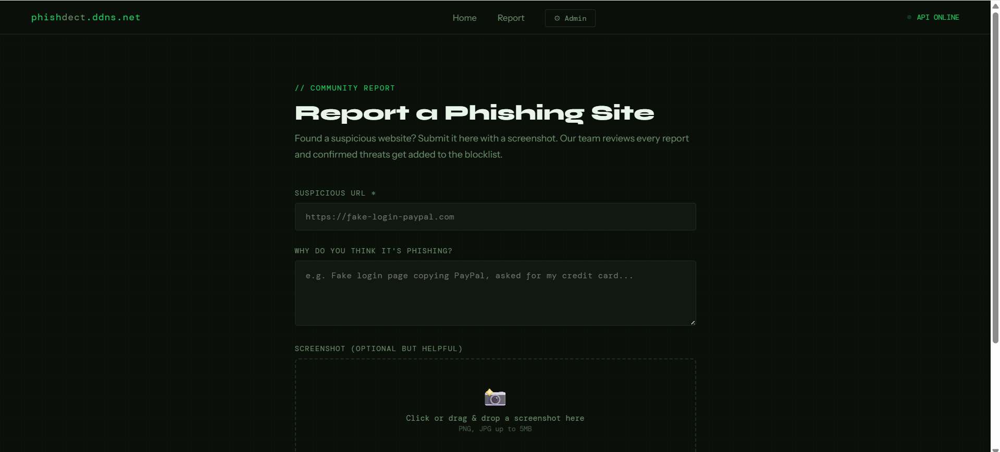
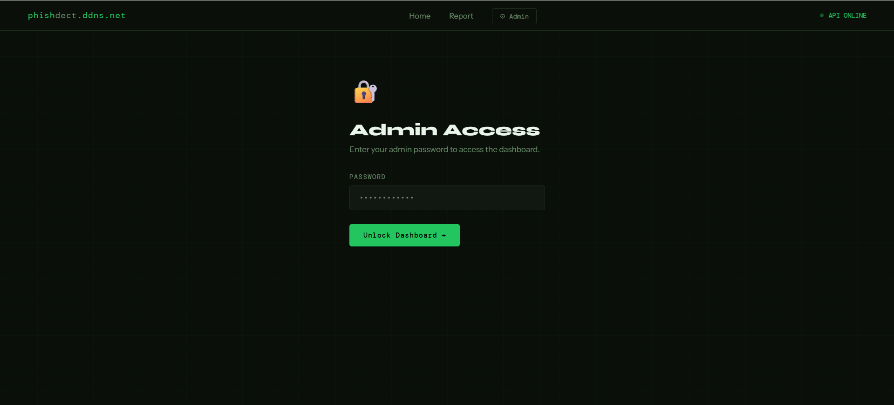

# Phishing Detection Extension

> Real-time phishing detection browser extension powered by a 5-layer hybrid ML pipeline — live on Chrome and Firefox.

[](http://phishdect.ddns.net)
[](https://addons.mozilla.org/en-US/firefox/addon/phishdect/)
[](#)



---

## What it does

Every URL you visit gets checked in real time through a 5-layer hybrid ML pipeline. The extension shows a safety score (1–10) — green means safe, red means phishing.

| Safe URL | Phishing Detected |
|:---:|:---:|
|  |  |

---

## How it works

Pure ML alone isn't enough. This uses a hybrid system where each layer covers the others' blind spots:

```
URL Input
    │
    ▼
Layer 1: Google Safe Browsing API    →  known phishing/malware database (instant)
    │
    ▼
Layer 2: WHOIS Domain Age Check      →  domains < 6 months flagged as high risk
    │
    ▼
Layer 3: URL Feature Extraction      →  30+ hand-crafted features
                                        (length, subdomains, special chars,
                                         suspicious keywords, TLD risk, etc.)
    │
    ▼
Layer 4: TF-IDF (char n-grams)       →  XGBoost classifier
         + hand-crafted features
    │
    ▼
Layer 5: Risk Score Fusion           →  weighted combination → score 1–10
    │
    ▼
Extension UI                         →  badge / warning / blocking popup
```

**Accuracy: 96.4%** on a 1,000-URL test set
| TP | TN | FP | FN |
|---|---|---|---|
| 482 | 479 | 21 | 18 |

---

## Community Reporting

Found a phishing site the model missed? Report it directly from the extension or via the web UI.



Reports are logged via Google Sheets API. Confirmed threats get their risk score boosted for all users — crowdsourcing catches newly-emerging phishing sites before databases pick them up.

---

## Admin Dashboard



Password-protected admin panel to review community reports and manage the blocklist.

---

## Tech Stack

| Component | Technology |
|---|---|
| ML Model | XGBoost + TF-IDF (char n-grams) |
| Feature Engineering | scikit-learn, custom extractors |
| Domain Intelligence | WHOIS, Google Safe Browsing API |
| Backend | Flask, Gunicorn, Flask-SQLAlchemy |
| Database | SQLite (scan logging) |
| Community Reporting | Google Sheets API |
| Browser Extension | JavaScript, Manifest V3 |
| Deployment | AWS EC2, Nginx, systemd, Let's Encrypt SSL |

---

## Project Structure

```
Phishing-Detection-Extension/
├── backend/
│   ├── app.py               # Flask API — POST /check_url
│   ├── features.py          # URL feature extraction (30+ features)
│   ├── domain_features.py   # WHOIS domain age lookup
│   ├── intelligence.py      # Google Safe Browsing API
│   ├── model.pkl            # Trained XGBoost model
│   └── vectorizer.pkl       # Fitted TF-IDF vectorizer
├── extension/
│   ├── manifest.json        # Manifest V3
│   ├── popup.html           # Extension UI
│   ├── popup.js             # API call + score display
│   └── background.js        # Tab URL change listener
└── screenshots/
```

---

## Setup & Run

**Backend:**
```bash
cd backend
pip install -r requirements.txt
export SAFE_BROWSING_API_KEY=your_key_here
python app.py
```

**Load in Chrome:**
1. Go to `chrome://extensions/`
2. Enable Developer Mode
3. Click "Load unpacked" → select the `extension/` folder

**Firefox:** Install directly from [addons.mozilla.org](https://addons.mozilla.org/en-US/firefox/addon/phishdect/)

---

## Deployment

Running 24/7 on AWS EC2 (Ubuntu) at [phishdect.ddns.net](http://phishdect.ddns.net)

- **Gunicorn** — production WSGI server with multiple workers
- **Nginx** — reverse proxy + SSL termination
- **systemd** — auto-restart on crash or reboot
- **Let's Encrypt** — free HTTPS via Certbot

---

## Future Work

- [ ] Redis caching for WHOIS lookups (reduce 200–500ms latency)
- [ ] Visual similarity detection vs. top-1000 brand logos
- [ ] Levenshtein lookalike domain detection (`paypa1.com` vs `paypal.com`)
- [ ] User feedback loop + periodic model retraining
- [ ] Multilingual URL support (Telugu/Hindi)

---

## Demo

[LinkedIn Demo Post](https://www.linkedin.com/posts/ramcharan-reddy-5994402a3_cybersecurity-machinelearning-chromeextension-activity-7448353656892198912-_p5X)
